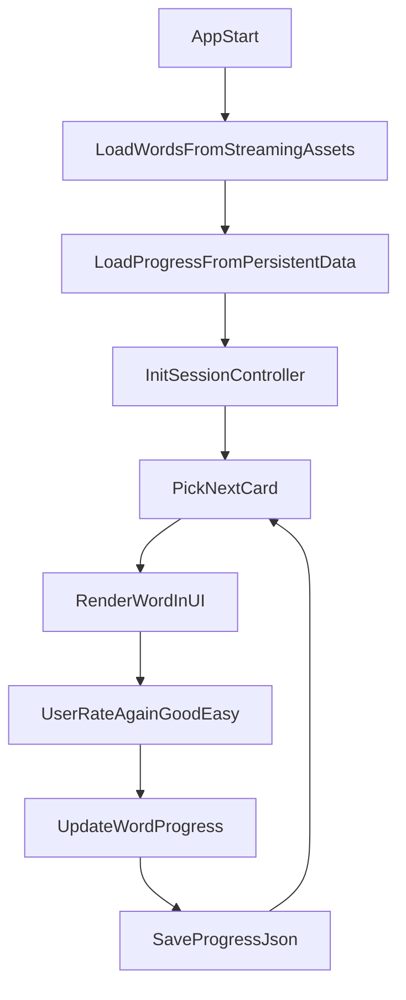

# 英语离线背词 MVP 计划

## 目标与范围

- 在不依赖网络的前提下，完成最小可用流程：加载词库 -> 展示单词 -> 用户评分(`Again/Good/Easy`) -> 更新复习时间 -> 本地保存进度。
- 仅覆盖 MVP 必需能力，不引入复杂算法、账户系统、云同步或多场景架构。

## 现状基线

- 词库已存在于 `[D:/Work/EnglishLearnTool/Assets/StreamingAssets/words](D:/Work/EnglishLearnTool/Assets/StreamingAssets/words)`，格式为 frontmatter 风格 `md` 文件（如 `word/meaning/correct/note/category`）。
- 当前项目场景可从 `[D:/Work/EnglishLearnTool/Assets/Scenes/SampleScene.unity](D:/Work/EnglishLearnTool/Assets/Scenes/SampleScene.unity)` 起步。
- 当前 `Assets` 下暂无业务脚本，可按 MVP 新增最小脚本集合。

## 模块拆分（MVP 最小集合）

- `WordEntry`：词条静态数据模型（来自 `StreamingAssets`）。
- `WordProgress`：单词学习状态模型（熟悉度、下次复习时间、错误次数）。
- `WordRepository`：读取并解析 `words/*.md`，输出 `List<WordEntry>`。
- `ReviewScheduler`：从“到期词 + 新词”中选择下一题，并根据评分更新间隔。
- `ProgressStore`：将 `Dictionary<string, WordProgress>` 持久化到 `persistentDataPath`。
- `SessionController`：串联仓储、调度、存储并提供 UI 可调用接口。
- `StudyPanel`（MonoBehaviour）：UI 桥接脚本，仅负责展示和按钮回调。

## 数据流与执行时序

## 迭代阶段与验收标准

### 阶段 1：词库加载可用

- 实现 `WordRepository`，支持批量读取 `words` 目录 `md` 文件。
- 解析失败词条仅记录日志并跳过，不阻断整体启动。
- **验收**：启动后能拿到非空词条列表，并在日志输出总数/失败数。

### 阶段 2：复习调度可跑

- 实现 `ReviewScheduler` 基础策略：
  - 优先到期词(`nextReview <= now`)
  - 其次新词（无进度记录）
- 评分映射间隔（MVP 固定值）：`Again=0天, Good=2天, Easy=5天`。
- **验收**：连续评分后能观察到同一单词下次复习时间变化。

### 阶段 3：进度持久化闭环

- 实现 `ProgressStore` JSON 读写，路径放 `Application.persistentDataPath`。
- 采用“临时文件写入 -> 替换正式文件”降低损坏风险。
- **验收**：重启应用后，已学习词的状态被正确恢复。

### 阶段 4：UI 最小闭环

- 在 `SampleScene` 放置最小学习面板：单词、释义区、评分按钮、统计文本。
- `StudyPanel` 只做显示与按钮转发，不包含调度业务逻辑。
- **验收**：可完整完成“看词 -> 评分 -> 下一题”循环。

### 阶段 5：稳定性与可观测性

- 增加关键日志：加载耗时、词条数、评分次数、保存结果。
- 增加容错：空词库提示、损坏进度文件自动回退。
- **验收**：异常数据下不崩溃，至少给出可理解提示。

## 建议落地路径（文件级）

- 场景沿用并改造：`[D:/Work/EnglishLearnTool/Assets/Scenes/SampleScene.unity](D:/Work/EnglishLearnTool/Assets/Scenes/SampleScene.unity)`
- 词库目录保持不变：`[D:/Work/EnglishLearnTool/Assets/StreamingAssets/words](D:/Work/EnglishLearnTool/Assets/StreamingAssets/words)`
- 新增脚本建议集中到：`D:/Work/EnglishLearnTool/Assets/Scripts/WordLearning/`
  - `Models/WordEntry.cs`
  - `Models/WordProgress.cs`
  - `Data/WordRepository.cs`
  - `Data/ProgressStore.cs`
  - `Domain/ReviewScheduler.cs`
  - `Domain/SessionController.cs`
  - `UI/StudyPanel.cs`

## 非目标（本期明确不做）

- 不做 SM-2/FSRS 等高级记忆算法。
- 不做联网同步与账号体系。
- 不做复杂动画/多页面 UI。
- 不做多语言本地化与音频朗读（留到下一迭代）。

## 风险与应对

- `StreamingAssets` 平台差异（尤其 Android）导致读取方式不同：仓储层封装统一读取接口，后续可替换实现。
- 前置数据格式不一致导致解析失败：采用“逐文件容错 + 汇总告警”。
- 频繁写盘影响性能：MVP 先每题保存，后续可改为节流/批量保存。
